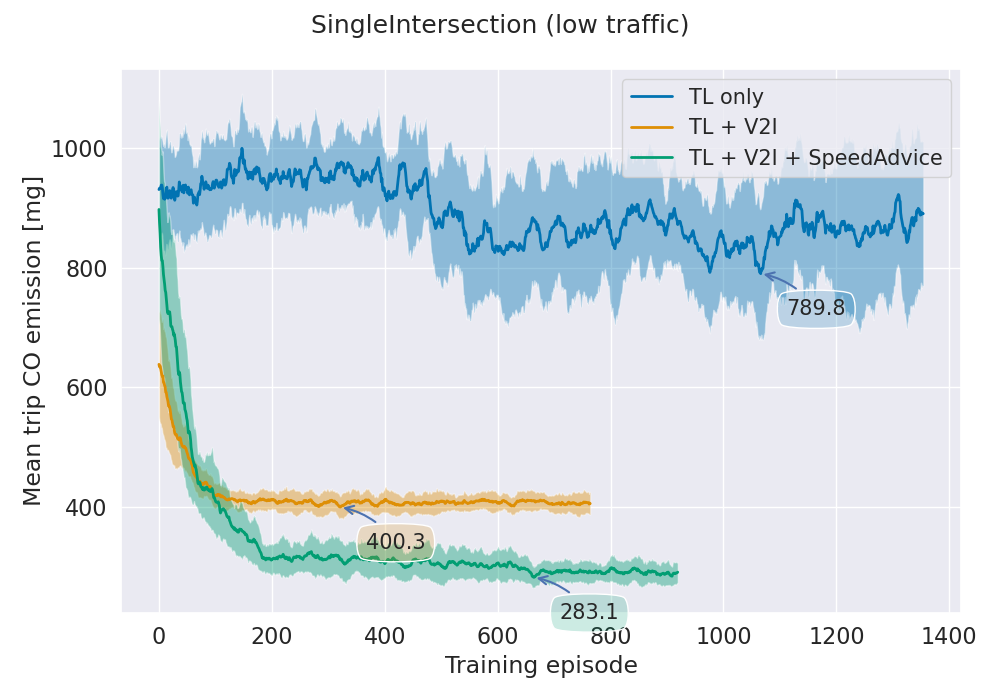

# RELESAS
"***RE**inforcement **LE**arning **S**ignal **A**nd **S**peed control*"

<br>

*RELESAS* provides an easy-to-use interface for traffic control on the base of Multi Agent Reinforcement Learning with [SUMO](https://github.com/eclipse/sumo).

Firstly starting as a reimplementation of [SUMO-RL](https://github.com/LucasAlegre/sumo-rl), *RELESAS* went a step further to integrate a few more features. Summed-up, this repo offers the following core functionalities:
1. **Traffic light** control ‒ either solely based on lane statistics (SUMO-RL), or utilizing also information on lane-leading vehicles (V2I*),
2. Lane-based **vehicle speed** control. That is, to selectively reduce the traffic speed to prevent queueing-up and thus preserving traffic flow. Speed control can be either applied to an entire lane, or just to the leading vehicle.

The folder where most of the modules reside, is [environment](./environment). A few of the herein enclosed classes are:
- The [BaseEnv](./environment/base_env.py) handles low-level stuff, such as starting/resetting/quitting SUMO, obtaining trip info of arrived vehicles, etc. When implementing own environments, one could take this as a useful starting point by inheriting from it.
- [GymEnv](./environment/env.py) directly inherits from *BaseEnv* and implements higher-level logic. That is, handling the enclosed *actuator* instances and implementing the `gym` interface.
- [RLLibEnv](./environment/env.py) forms a thin wrapper around *GymEnv* such that it can be interfaced by RLLib.
- The [actuators](./environment/actuators), forming an abstraction for various agents types that may act within the environment. So-far implemented actuators are [TrafficLight](./environment/actuators/traffic_light.py), [Lane](./environment/actuators/lane.py) and [LaneCompound](./environment/actuators/lane_compound.py). More information on the actuators is provided below.
- [MetricsWrapper](./environment/wrappers/metrics_wrapper.py) wraps the *RLLibEnv* and occasionally writes stats into a set of YAML and CSV files. Using these files, one can later plot the results of finished training runs (see below).
- [env_config_templates.py](./environment/env_config_templates.py) contains multiple functions, each providing template [GymEnv.Config](./environment/env.py) objects pointing to standard SUMO scenarios. Most of these scenarios stem from SUMO-RL and [RESCO](https://github.com/Pi-Star-Lab/RESCO).

Furthermore, this repo implements a [MetricsCallback](callbacks/metrics_callbacks.py) to report training progress to `Tensorboard`. 

To make training results comparable, this framework implements **RESCO's trip delay metric**. This metric consists of the *mean vehicle [time loss](https://sumo.dlr.de/docs/Simulation/Output/TripInfo.html)* (in seconds), and is computed each time an episode ends.  

<br>

***V2I**, short for *Vehicle-To-Infrastructure*: Vehicles constantly report their speeds/positions/etc. to the infrastructure.


## Actuator types
The so-far present actuator types serve the purposes of **traffic light** control and **vehicle speed** control. 

With the prior being represented by the [TrafficLight](./environment/actuators/traffic_light.py) actuator, the latter was implemented as [Lane](./environment/actuators/lane.py) and [LaneCompound](./environment/actuators/lane_compound.py). Why separating into the last two? 

The reason is computational resources. While *Lane* was the first to be implemented (and works fine!), it soon became evident that providing an agent for each single controlled lane meant too much of a computational load ‒ the trainings became too slow, especially on larger scenarios. 
*LaneCompound* is an attempt to mitigate this by combining multiple spatially-close lanes. The result was training times being reduced by about 50+%, while maintaining equal performance.
Note that the usage of *Lane* and *LaneCompound* is **mutually exclusive**!

**Implementing new actuators** <br>
By offering the *actuators* interface, this framework can be easily extended by new agent types. For doing so, the following steps should be followed:
1. Place the actuator code into a new file within the [actuators](./environment/actuators) folder
2. Create a new class that inherits from [BaseActuator](./environment/actuators/base_actuator.py). Implement the abstract functions.
3. Extend [GymEnv](./environment/env.py) to instantiate the new actuator class and to return its instances from within the `_actuators` property


## Install

### Installing SUMO
```bash
sudo add-apt-repository ppa:sumo/stable
sudo apt-get update
sudo apt-get install sumo sumo-tools sumo-doc 
```
When developing this framework, SUMO version `1.15.0-1` was used.

After having SUMO installed, the SUMO_HOME variable must be set (with default sumo installation path being `/usr/share/sumo`)
```bash
echo 'export SUMO_HOME="/usr/share/sumo"' >> ~/.bashrc
source ~/.bashrc
```

**Important** <br>
Setting the environment variable `LIBSUMO_AS_TRACI=1` is not recommended, as this framework heavily utilizes multiprocessing. See Libsumo limitations [here](https://sumo.dlr.de/docs/Libsumo.html).

### Downloading this framework
I explicitly decided against publishing this work on PyPI, because ‒in order to start trainings‒ it is necessary to change a few lines in the enclosed [train.py](./train.py). Also, having the code present, makes it easier to experiment and implement own features.

To download *RELESAS*, enter the following lines
```bash
cd ~/path/to/folder
git clone https://github.com/robvoe/RELESAS
```

### Build Conda environment
This step requires [Conda](https://docs.conda.io/projects/conda/en/latest/user-guide/install/) to be installed.
```bash
cd ~/path/to/RELESAS
conda env create -f environment.yml 
```

### Unpack the trained sample models for scenario SingleIntersection
```bash
cd ~/path/to/RELESAS/outputs
7z x examples-single-intersection.7z.001
```

The shipped evaluation scripts refer to these trainings, in order to provide a few examples.

**Training on GPU**<br>
In order to conduct GPU-enabled trainings, one must include the commented *cudatoolkit* line in `environment.yml` before building the Conda env. In addition to that, the `train.py` file accordingly needs a minor modification. Nevertheless, the benefit from using GPU is expected to be limited, as the network sizes are too small to outweigh the copy-to-GPU cost.


## Run trainings
The trainings start from [train.py](./train.py). I explicitly decided against creating an *argparse monster*, because I find them difficult to extend/understand/maintain. Instead, the user is expected to parametrize the trainings within [train.py](./train.py) itself. 

The only parameters that have to be supplied to a training are `experiment_name` and `env_name`. While the first can be an arbitrarily chosen name, the second follows the naming of the functions found in [env_config_templates.py](./environment/env_config_templates.py) 


A training can be started with the following lines from shell:
```bash
cd ~/path/to/RELESAS
conda activate RELESAS
python train.py  --env_name sumo_rl_single_intersection  --experiment_name training-si.1
```

**Single trials & compound trials**<br>
Since RL (or better, DL in general) is strongly stochastic, each training run may look a bit different from others ‒ even if it was started with exactly the same parameters set. To make the train results a bit more reasonable, [train.py](./train.py) per default starts so-called **trial compounds**. These represent a multitude of parallel, equally-parametrized **single trials** (usually 5).

**Training outputs**<br>
Right after starting a training, a new subfolder is created within `outputs` ‒ which in case of the training run being a *trial compound* contains N *single trial* directories. Inside each *single trial* folder, one can find checkpoints, Tensorboard logs, metrics logs and more.

**Checkpointing & early stopping**<br>
During training, each time a model is found to be better than a previous one (see **RESCO trip delay** above), a model checkpoint is saved to the folder `outputs/trial-compound/single-trial/checkpoint`. As soon as a model is found not to be improving anymore, the trial stops prematurely. Note that potential other parallel trials may keep running.

**Observing running trainings using Tensorboard**<br>
During an ongoing training, one can observe the model convergence using Tensorboard.
```bash
cd ~/path/to/RELESAS
conda activate RELESAS
tensorboard --logdir outputs
tensorboard --logdir_spec label1:outputs/trial-compound1,label2:outputs/trial-compound2
```
While the first shows all contents from the `outputs` folder, the second can be used to show only certain trainings.

**Plotting training results**<br>
Statistics collected during training can be plotted using [plot_episode_end_metrics.py](./plot_episode_end_metrics.py). See function `test_plot_exemplary_trainings()` on how to plot the shipped exemplary trainings. The uncertainty boundaries come from the number of three parallel, equally-parametrized trainings.





**Loading model checkpoints and evaluation**<br>
The module [util/evaluation.py](./util/evaluation.py) offers logic to load checkpointed models and run evaluation on them. Examples on how to use evaluation can be found in the same file.

**Running trainings using Singularity**<br>
Singularity is a container platform that's often found in high performance computing (HPC) environments. Since a user usually is not able to install software (in this case SUMO), trainings have to take place within containers. This repo provides a definition file of such a Singularity container ‒ including SUMO and a pre-installed Conda environment.

Enter the following lines to **build** the container. Note that *sudo* permissions are necessary ‒ but often it is enough to build the container locally and transfer it to the HPC afterwards (the .sif file). 
```bash
cd ~/path/to/RELESAS/singularity
sudo singularity build train-container.sif train-container.def
```

Later on, trainings can be **run** as follows, without *sudo* permissions.
```bash
cd ~/path/to/RELESAS
singularity  run  ~/path/to/RELESAS/singularity/train-container.sif   python  ~/path/to/RELESAS/train.py  --env_name sumo_rl_single_intersection  --experiment_name training-si.1
```


## Scenarios
*RELESAS* ships common scenarios from RESCO and SUMO-RL. These can be found in the folder [scenarios](./scenarios). Note that all scenarios are distributed under their original licenses, see their regarding subfolders.


RESCO's results on the respective scenarios can be found in their [paper](https://people.engr.tamu.edu/guni/Papers/NeurIPS-signals.pdf).


## Influences from SUMO-RL
*RELESAS* loosely bases on SUMO-RL. This majorly means that a few implementation details were adopted from SUMO-RL's `TrafficSignal` class, as well as a few details on SUMO application handling.

In opposition to SUMO-RL, it is not this repo's goal to offer compatibility to various MARL frameworks. The only so-far supported framework is `RLLib`. Nevertheless, adapting the [GymEnv](./environment/env.py) to another MARL framework shouldn't be a big deal at all!
